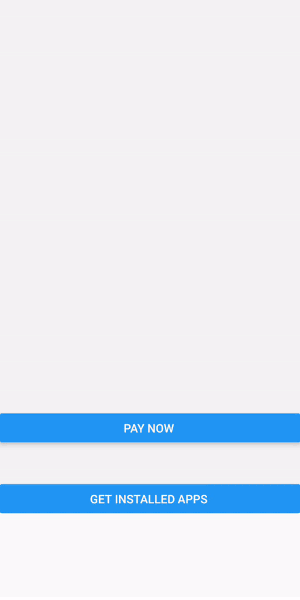

# one-react-native-upi

This library uses intent to use UPI as a payment gateway without any payment fees. It communicates peer-to-peer which enables the application to support UPI payments by detecting the installed application on the user's phone.  UPI application responds with a transcations summary in JSON format. 


## Features

- Light weight  ⚖️
- Easy to integrate 🔌
- Works on all UPI Apps 🚀


## Badges


[](https://choosealicense.com/licenses/mit/)

[](https://opensource.org/licenses/)

[](http://www.gnu.org/licenses/agpl-3.0)


## Screenshots




## Note

This library is currently supported by Android only. Please add feature request in order to update the library with iOS support.


## Installation

Install one-react-native-upi with npm

```bash
npm install one-react-native-upi
```

Install one-react-native-upi with yarn

```bash
yarn add one-react-native-upi
```

Add queries in AndroidManifest.xml within `` <manifest> </manifest> ``  tag. You can add more appication (UPI Apps) by knowing their packageName.

```bash
<queries>
   <package android:name="com.phonepe.app" />                        //Phonepe
    <package android:name="com.google.android.apps.nbu.paisa.user" /> // GPay
    <package android:name="net.one97.paytm" />                        // Paytm
    <package android:name="in.org.npci.upiapp" />                     // BHIM
    <package android:name="in.amazon.mShop.android.shopping" />       // AmazonPay
</queries>
```
    
## Installation

Install one-react-native-upi with npm

```bash
npm install one-react-native-upi
```

Install one-react-native-upi with yarn

```bash
yarn add one-react-native-upi
```

Add queries in AndroidManifest.xml within `` <manifest> </manifest> ``  tag. You can add more application (UPI Apps) by knowing their packageName.

```bash
<queries>
   <package android:name="com.phonepe.app" />                        //Phonepe
    <package android:name="com.google.android.apps.nbu.paisa.user" /> // GPay
    <package android:name="net.one97.paytm" />                        // Paytm
    <package android:name="in.org.npci.upiapp" />                     // BHIM
    <package android:name="in.amazon.mShop.android.shopping" />       // AmazonPay
</queries>
```
    
## Usage 

#### To get installed UPI apps 


```javascript
import OneUpi from 'one-react-native-upi'
import {Button} from 'react-native


function App() {
  return  <Button
          title="Get installed apps"
          onPress={() =>
           const apps =  OneUpi.getInstalledUPIApps()
           console.log(apps)
         }
        />
}
```

`OneUpi.getInstalledUPIApps()`  returns `String[] ` of installed packageName. If the array is empty that means no apps are installed that supports upi payments


#### To initiate payment

```javascript
import OneUpi from 'one-react-native-upi'
import {Button} from 'react-native


const config =  {
 upiId: 'yourmechantid@paytm', 
 name: 'Sonu',
 note: 'Test payment',
 amount: '100',
 targetPackage: "in.org.npci.upiapp",    
 }

 const onSuccess = (success) => {
     console.log({success})
 }
 const onFailure = (error) => {
     console.log({error})
 }

function App() {
  return  <Button
          title="Pay now"
          onPress={() =>
            OneUpi.initiate(
              config,
              onSuccess,
              onFailure,
            )
          }
        />
}
```

#### config arguements 
```json
{
/*
 - Required
 - Upi id of merchant to whom it will get paid
 - Note : UPI Id should be a merachant. Personal upi will not get processed as per ncpi doc */

 upiId: 'yourmechantid@paytm',

/*
 - Required
 - Merchant name
  */

 name: 'Sonu',

 /*
 - Required
 - Payment note
  */
 note: 'Test payment',

 /*
 - Required
 - Amount to be paid 
  */

 amount: '100',

 /*
 - Optional
 - if you dont provide targetPacakge then
  it will automatically opens up the chooser bottomsheet with all the supported apps 
 -invoke getInstalledUPIApps method to get all the apps.  
  */

 targetPackage: "in.org.npci.upiapp",  


/*
 - Optional
 - If you want custom text on chooser text such "Pay Now", "Pay With" 
 - Note : if you pass targetPackage, it will not be reflected  */

 chooserText : "Pay with"
}
```


#### onSuccess response  
```json
{

 status: 'SUCCESS',   //payment status

 txnId: string, //transaction ID

 code: string, //Response code

 approvalRefNo: string, //Transaction Reference Number

}
```


#### onFailure response  
```json
{

 status: 'FAILED',   //payment status

 message: string, //erro message

}
```


## FAQ

#### Will it work with ios?

No, it currently supports android

#### Which apps are supported?

 I have tested on PayTM, PhonePe, GPay, AmazonPay as of now . 


## Author

- [@devsonuyadav](https://github.com/devsonuyadav)


## Support

For support, email sky32752@gmail.com. 


## License

[MIT](https://choosealicense.com/licenses/mit/)
